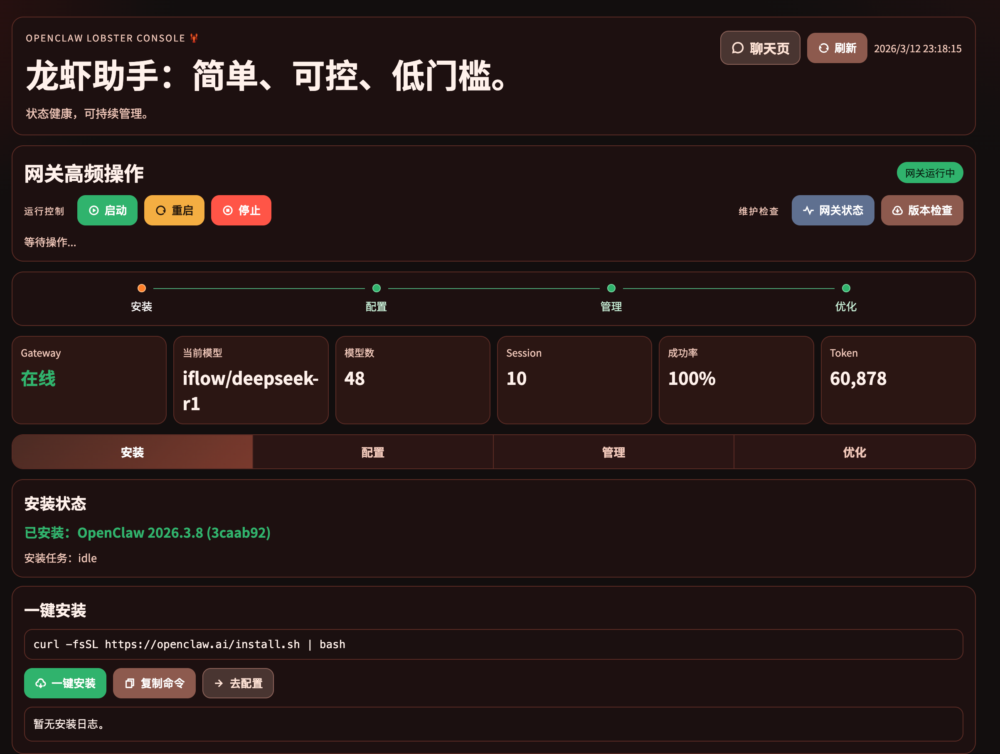
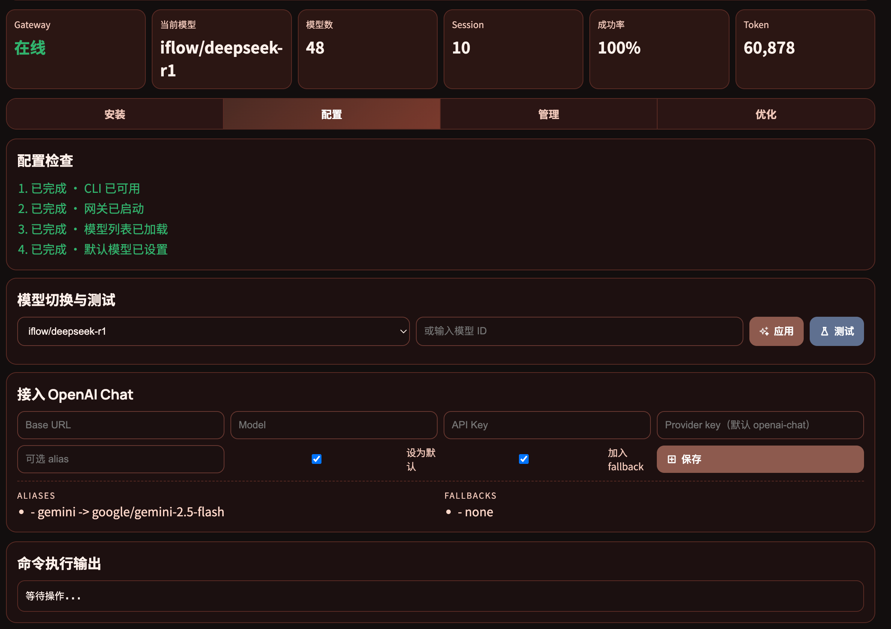
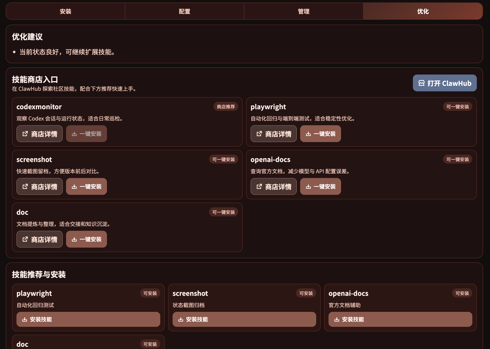

# OpenClaw Dashboard Pro

[中文说明](./README.zh-CN.md)

## What this project solves
OpenClaw Dashboard Pro is a local, browser-based console for managing OpenClaw with a low barrier to entry. After the server starts, most tasks are done in the UI without running OpenClaw CLI commands.

## What you can do
- Check if OpenClaw is installed and up to date
- Install and update OpenClaw with one click
- Switch models and run connectivity tests
- Control the gateway (start / restart / stop / status)
- Manage sessions (create / cleanup / list)
- Get optimization tips and skill recommendations

## Who it's for
- Users who want a quick, visual OpenClaw setup
- Teams that need a simple local control panel

## Requirements
- Node.js 18+
- macOS / Linux (Windows via WSL)
- `openclaw` installed (can be installed from the UI)

## Quick start
1. Clone
```bash
git clone <your-repo-url> openclaw-dashboard-pro
cd openclaw-dashboard-pro
```

2. Start
```bash
node server.mjs
```

3. Open
```text
http://127.0.0.1:19190
```

## Screenshots
Overview (install + gateway)


Configure (model switch + OpenAI Chat)


Optimize (skills & recommendations)


## Configuration
- Port: `PORT` (default `19190`)
- Host: `HOST` (default `0.0.0.0`)

## Security and privacy
- This repository contains no secrets or tokens.
- Any API key entered in the UI is written to the local OpenClaw `models.json` (outside this repo).
- Do not commit your OpenClaw config directory.

## Documentation
- English: `docs/Usage.md`
- 中文：`docs/使用文档.md`

## Project structure
```text
.
├── server.mjs          # Local HTTP server
├── public/             # Frontend assets
├── docs/               # User docs (Chinese)
└── .gitignore
```

## FAQ
1. The page doesn't load  
Verify the server is running and port 19190 is listening:
```bash
lsof -nP -iTCP:19190 -sTCP:LISTEN
```

2. Buttons do nothing  
Check the "Command Output" log on the page and verify `openclaw --version`.

## Contributing
Please read `CONTRIBUTING.md`.

## Security
Please read `SECURITY.md`.

## License
MIT License. See `LICENSE`.
